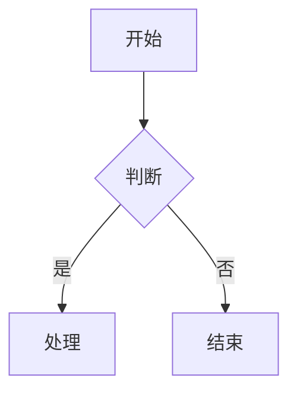

# 创建飞书云文档

## 前提条件

用户需已绑定 Feishu MCP URL。如未绑定，请引导用户参考 feishu-mcp-bind skill 完成绑定。

## 调用方式：HTTP 直接调用

通过 Bash curl 直接调用飞书 MCP 的 Streamable HTTP 接口。**不要使用 MCP 工具，直接 HTTP 调用。**

### 第一步：获取 MCP URL

从会话目录读取：
- **群聊**：读取 `authors.json`，找当前发送者 `ou_xxx` 对应的 `feishuMcpUrl`
- **私聊**：读取 `feishu-mcp-url` 文件

### 第二步：初始化会话

```bash
curl -s -D- -X POST "<MCP_URL>" \
  -H "Content-Type: application/json" \
  -H "Accept: application/json, text/event-stream" \
  -d '{"jsonrpc":"2.0","id":0,"method":"initialize","params":{"protocolVersion":"2025-03-26","capabilities":{},"clientInfo":{"name":"sigma","version":"1.0"}}}'
```

从响应 header 中获取 `mcp-session-id`。

### 第三步：调用 create_doc

```bash
curl -s -X POST "<MCP_URL>" \
  -H "Content-Type: application/json" \
  -H "Accept: application/json, text/event-stream" \
  -H "Mcp-Session-Id: <session_id>" \
  -d '{"jsonrpc":"2.0","id":1,"method":"tools/call","params":{"name":"create_doc","arguments":{"title":"文档标题","markdown":"文档内容..."}}}'
```

---

# 返回值

工具成功执行后，返回一个 JSON 对象，包含以下字段：

- **`doc_id`**（string）：文档的唯一标识符（token），格式如 `doxcnXXXXXXXXXXXXXXXXXXX`
- **`doc_url`**（string）：文档的访问链接，可直接在浏览器中打开
- **`message`**（string）：操作结果消息

# 参数

## markdown（必填）
文档的 Markdown 内容，使用 Lark-flavored Markdown 格式。

调用本工具的markdown内容应当尽量结构清晰,样式丰富, 有很高的可读性. 合理的使用callout高亮块, 分栏,表格等能力,并合理的运用插入图片与mermaid的能力,做到图文并茂.
你需要遵循以下原则:

- **结构清晰**：标题层级 ≤ 4 层，用 Callout 突出关键信息
- **视觉节奏**：用分割线、分栏、表格打破大段纯文字
- **图文交融**：流程和架构优先用 Mermaid/PlantUML 可视化
- **克制留白**：Callout 不过度、加粗只强调核心词

当用户有明确的样式,风格需求时,应当以用户的需求为准!!

**重要提示**：
- **禁止重复标题**：markdown 内容开头不要写与 title 相同的一级标题！title 参数已经是文档标题，markdown 应直接从正文内容开始
- **目录**：飞书自动生成，无需手动添加
- Markdown 语法必须符合 Lark-flavored Markdown 规范，详见下方"内容格式"章节
- 创建较长的文档时,强烈建议配合update-doc中的append mode, 进行分段的创建,提高成功率.

## title（可选）
文档标题。

## folder_token（可选）
父文件夹的 token。如果不提供，文档将创建在用户的个人空间根目录。

folder_token 可以从飞书文件夹 URL 中获取，格式如：`https://xxx.feishu.cn/drive/folder/fldcnXXXX`，其中 `fldcnXXXX` 即为 folder_token。

## wiki_node（可选）
知识库节点 token 或 URL（可选，传入则在该节点下创建文档，与 folder_token 和 wiki_space 互斥）

## wiki_space（可选）
知识空间 ID（可选，传入则在该空间根目录下创建文档。特殊值 `my_library` 表示用户的个人知识库。与 wiki_node 和 folder_token 互斥）

**参数优先级**：wiki_node > wiki_space > folder_token

# 示例

## 示例 1：创建简单文档

```json
{
  "title": "项目计划",
  "markdown": "# 项目概述\n\n这是一个新项目。\n\n## 目标\n\n- 目标 1\n- 目标 2"
}
```

## 示例 2：创建到指定文件夹

```json
{
  "title": "会议纪要",
  "folder_token": "fldcnXXXXXXXXXXXXXXXXXXXXXX",
  "markdown": "# 周会 2025-01-15\n\n## 讨论议题\n\n1. 项目进度\n2. 下周计划"
}
```

## 示例 3：使用飞书扩展语法

```json
{
  "title": "产品需求",
  "markdown": "<callout emoji=\"💡\" background-color=\"light-blue\">\n重要需求说明\n</callout>\n\n## 功能列表\n\n<lark-table header-row=\"true\">\n| 功能 | 优先级 |\n|------|--------|\n| 登录 | P0 |\n| 导出 | P1 |\n</lark-table>"
}
```

## 示例 4：创建到知识库节点下

```json
{
  "title": "技术文档",
  "wiki_node": "wikcnXXXXXXXXXXXXXXXXXXXXXX",
  "markdown": "# API 接口说明\n\n这是一个知识库文档。"
}
```

## 示例 5：创建到个人知识库

```json
{
  "title": "学习笔记",
  "wiki_space": "my_library",
  "markdown": "# 学习笔记\n\n这是创建在个人知识库中的文档。"
}
```

# 内容格式

文档内容使用 **Lark-flavored Markdown** 格式，这是标准 Markdown 的扩展版本，支持飞书文档的所有块类型和富文本格式。

## 通用规则

- 使用标准 Markdown 语法作为基础
- 使用自定义 XML 标签实现飞书特有功能
- 需要显示特殊字符时使用反斜杠转义：`* ~ ` $ [ ] < > { } | ^`

---

## 📝 基础块类型

### 文本（段落）

```markdown
普通文本段落

段落中的**粗体文字**

居中文本 {align="center"}
右对齐文本 {align="right"}
```

### 标题

飞书支持 9 级标题。H1-H6 使用标准 Markdown 语法，H7-H9 使用 HTML 标签：

```markdown
# 一级标题
## 二级标题
### 三级标题
#### 四级标题
##### 五级标题
###### 六级标题
<h7>七级标题</h7>
<h8>八级标题</h8>
<h9>九级标题</h9>

# 带颜色的标题 {color="blue"}
## 蓝色居中标题 {color="blue" align="center"}
```

颜色值：red, orange, yellow, green, blue, purple, gray

### 列表

```markdown
- 无序项1
  - 无序项1.a

1. 有序项1
2. 有序项2

- [ ] 待办
- [x] 已完成
```

### 引用块

```markdown
> 这是一段引用
> 可以跨多行
```

### 代码块

只支持围栏代码块（` ``` `），不支持缩进代码块。

### 分割线

```markdown
---
```

---

## 🎨 富文本格式

- `**粗体**` `*斜体*` `~~删除线~~` `` `行内代码` `` `<u>下划线</u>`
- 文字颜色：`<text color="red">红色</text>` `<text background-color="yellow">黄色背景</text>`
- 链接：`[链接文字](https://example.com)`
- 行内公式：`<equation>E = mc^2</equation>`

---

## 🚀 高级块类型

### 高亮块（Callout）

```html
<callout emoji="✅" background-color="light-green" border-color="green">
支持**格式化**的内容
</callout>
```

**常用**: 💡light-blue(提示) ⚠️light-yellow(警告) ❌light-red(危险) ✅light-green(成功)

**限制**: callout子块仅支持文本、标题、列表、待办、引用。不支持代码块、表格、图片。

### 分栏（Grid）

```html
<grid cols="2">
<column>
左栏内容
</column>
<column>
右栏内容
</column>
</grid>
```

### 表格

#### 标准 Markdown 表格

```markdown
| 列 1 | 列 2 |
|------|------|
| 单元格 1 | 单元格 2 |
```

#### 飞书增强表格

当单元格需要复杂内容（列表、代码块等）时使用 `<lark-table>` 标签。

```html
<lark-table column-widths="200,250,280" header-row="true">
<lark-tr>
<lark-td>

**表头1**

</lark-td>
<lark-td>

**表头2**

</lark-td>
</lark-tr>
<lark-tr>
<lark-td>

普通文本

</lark-td>
<lark-td>

- 列表项1
- 列表项2

</lark-td>
</lark-tr>
</lark-table>
```

### 图片

```html
<image url="https://example.com/image.png" width="800" height="600" align="center" caption="图片描述"/>
```

只支持 URL 方式，系统会自动下载图片并上传到飞书。支持 PNG/JPG/GIF/WebP/BMP，最大 10MB。

**本地图片**：先用 create-doc 创建文档，再用 `feishu_doc_media` 工具追加图片。

### 文件

```html
<file url="https://example.com/document.pdf" name="文档.pdf" view-type="1"/>
```

### 画板（Mermaid / PlantUML）

````markdown

````

支持: flowchart, sequenceDiagram, classDiagram, gantt, mindmap 等。也支持 PlantUML。

### 多维表格

```html
<bitable view="table"/>
```

### 提及用户

```html
<mention-user id="ou_xxx"/>
```

### 提及文档

```html
<mention-doc token="doxcnXXX" type="docx">文档标题</mention-doc>
```

---

## 🎯 最佳实践

- **空行分隔**：不同块类型之间用空行分隔
- **转义字符**：特殊字符用 `\` 转义
- **图片**：使用 URL，系统自动下载上传
- **分栏**：列宽总和必须为 100
- **表格选择**：简单数据用 Markdown，复杂嵌套用 `<lark-table>`
- **目录**：飞书自动生成，无需手动添加
